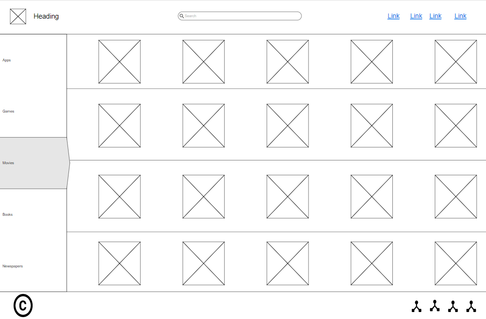

# Task 1
## 1
We are looking to solve a one of the new rising ways our society being utilizing  to increase their income ever since covid hit we have been sitting at home a lot more and we saw the rise of handmade pages on facebook, instagram looking to sell their handmade products with no real relabie platform where customers can’t check the prices without reaching out the page owner (a lot of pages leave comments saying ask for the price in the DMs speedily on facebook marketplace) or if the product is in stock and that ended with the lack of confidence between the buyers and the sellers and lacking the ability to trace the product on delivery and we decided to create a platform similar to talbat (which saw huge success) but for handmade product and individual vendor.

***

## 2 
Here’s a list of risks we might face during the development for our web pages:
* Poor time management : time is one of the most valuable and tricky resources we have while working as a team. If we dont manage work or couldn’t work on time we would be late to our release date .
* Bad team communication :  this could cost us time and money where you could essentially waste time writing code that conflicts or doesn’t work with the other code wasting time and money.
* Bad coding practices : when developing a big project the few bad codes habit could be detrimental when the code gets too big or multiple people working on the same code where the can’t figure what the code does or where it stores the variables..etc
* Change of the scope : This is where there is a little change that’s why the commotion  with the higher up and frequantin meetings so we are on the same page and not put in any unnecessary work and get the best result we can.

***
## 3 
1. List of requirement to get our website running :

* A home page to welcome the user 
* A store page holding the Items that are up for sale and add them into an array
*  cart that saves Items from store that are added 
* A cancel and buy buttons to buy or cancel the order 
* A payment pop up to enter your card info	

***

2. We  used a website called moqups to design our baseline wireframe :
* Home Page

* Store page

* About Us page

* Cart page

***

3. 
Diagram showing how the activity of the website is connected. 

***

4. 
Waterfall technique: is creating a planned before coding and sticking to it til the end then testing 
Agile technique : is planning small bits while working and testing all together which can be useful and individual work but seeing as that we are in a team it would result in a lot of conflicted code,

I would say we used a combination of waterfall and agile where we have planned the whole website beforehand and we started working and improving on the original plan as we went while testing every feature we added. 

***

5. You can check the answer for this question from stage 3 answers as I go over it there.