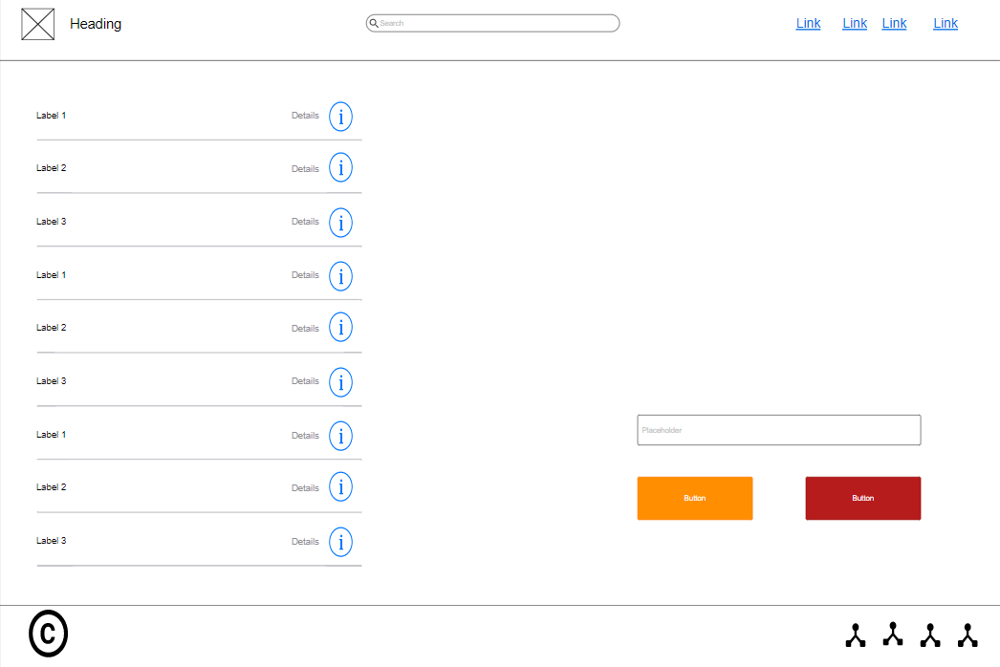
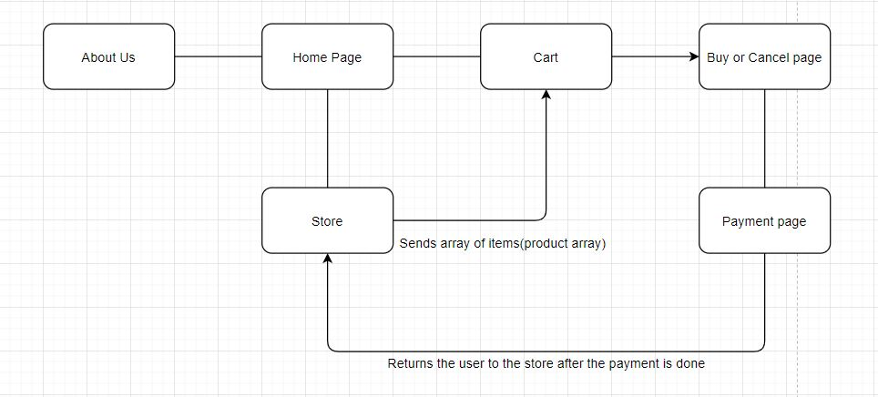

# Task 1
## 1
We are looking to solve a one of the new rising ways our society being utilizing  to increase their income ever since covid hit we have been sitting at home a lot more and we saw the rise of handmade pages on facebook, instagram looking to sell their handmade products with no real relabie platform where customers can’t check the prices without reaching out the page owner (a lot of pages leave comments saying ask for the price in the DMs speedily on facebook marketplace) or if the product is in stock and that ended with the lack of confidence between the buyers and the sellers and lacking the ability to trace the product on delivery and we decided to create a platform similar to talbat (which saw huge success) but for handmade product and individual vendor.

***

## 2 
Here’s a list of risks we might face during the development for our web pages:
* Poor time management : time is one of the most valuable and tricky resources we have while working as a team. If we dont manage work or couldn’t work on time we would be late to our release date .
* Bad team communication :  this could cost us time and money where you could essentially waste time writing code that conflicts or doesn’t work with the other code wasting time and money.
* Bad coding practices : when developing a big project the few bad codes habit could be detrimental when the code gets too big or multiple people working on the same code where the can’t figure what the code does or where it stores the variables..etc
* Change of the scope : This is where there is a little change that’s why the commotion  with the higher up and frequantin meetings so we are on the same page and not put in any unnecessary work and get the best result we can.

***
## 3 
1. List of requirement to get our website running :
A home page to welcome the user 
A store page holding the Items that are up for sale and add them into an array
A cart that saves Items from store that are added 
A cancel and buy buttons to buy or cancel the order 
A payment pop up to enter your card info	

***

2. We  used a website called moqups to design our baseline wireframe :
* Home Page

* Store page

* About Us page

* Cart page

***

3. 
Diagram showing how the activity of the website is connected. 

***

4. 
Waterfall technique: is creating a planned before coding and sticking to it til the end then testing 
Agile technique : is planning small bits while working and testing all together which can be useful and individual work but seeing as that we are in a team it would result in a lot of conflicted code,

I would say we used a combination of waterfall and agile where we have planned the whole website beforehand and we started working and improving on the original plan as we went while testing every feature we added. 

***

5. You can check the answer for this question from stage 3 answers as I go over it there.

# task 2 

## 1 

| Category | Tool |   | 
| --- | ----------- | ----------- | 
| IDE  | Visual Studio Code | PyCharm |
| Operating System | Linux | Windows | 
| Version-control platform | GitHub | GitLab | 

I will give a brief description for each tool from each category then I will say why I choice the tools 

***

* IDE

1. Visual Studio Code: is source code made by microsoft with built in git elements and it allows us to customize it with  the ability to install extension.

Some of the advantages and disadvantage:

| Advantages | Disadvantage |
| --- | ----------- |
| Built in git  | Barely any debugging features |
| free | Need to install alot of extension and plugins to have it working fully  |
| Low resource requirement  |  |

2. pyCharm: is a programming environment for programmers made by programmers with little to no built in programmers where it have high customizability with over 3000 extension. 

Some of the advantages and disadvantage:
| Advantages | Disadvantage |
| --- | ----------- |
| Easy installation  | Heavy on resource requirement  |
| Code compilation feature  | pyCharm community is forced on python so most of the focus is on that language  |
| A lot of extension   | Can be very expensive and the free version is ot very good |

***

* Operating System

1. Linux: is an open software operating system where the code can be change for the user needs also it is free.

Some of the advantages and disadvantage:
| Advantages | Disadvantage |
| --- | ----------- |
| Free to use | Good chunk of application are missing  |
| High security  | Not supported by any hardware  |
| Ability to customize the system fully  | No one single standard edition  |

2. Windows: is an operating system designed by microsoft easy to use and install but costs around 140$ for the home version.

Some of the advantages and disadvantage:
| Advantages | Disadvantage |
| --- | ----------- |
| Ease of use  | Expensive  |
| All of not most programs are available | Vulnerable to virus attack  | 
| Supported by many hardwareds | Not open source code of the system  |

***

* Version-control platform

1. GitHub: Is website where you can save your code to an online repository where it is saved on teh clode where you can share your code updated and let other change it if you want and pull updated code from it.

Some of the advantages and disadvantage:
| Advantages | Disadvantage |
| --- | ----------- |
| HeaOne of the best open-sources systems der | Bad API development  |
| Simple to set up | Not good private reporestoy system  |
| Simple to share with people  | Not many features  |

2. GitLab: Is essentially the same as github but they differ in the service where it focus on the more private repository for teams and not open source code.

Some of the advantages and disadvantage:
| Advantages | Disadvantage |
| --- | ----------- |
| Consistent features updated  | Bad updating system  |
| Help to easily maintain code  | Lots of bugs |
| Great private repository system  | Not used by many people  |

***

## 2

* IDE: Visual Studio Code (VScode)
I choose VScode for it being 0$ also with it's built in git and where it doesn't consume as much as pyCharm from my memory where I can just install extensions to make it a complete for me needs also pyCharm costs like 200$ a year the only thing I be missing out one is a debugger which I wouldn’t use either way.

* Operating System: Windows
I’ll be using windows since it has more applications and I only need ubuntu’s terminal to work from Linux which I have downloaded from the microsoft play store giving me access to the ubuntu’s terminal commands and functionality best of both worlds easy of use and a lot of appalachian from windows and the terminals from ubuntu to help me get the best results.

* Version-control platform : GitHub
We'll be working on GitHub since I will be working on a team of 5 and the team is already familiar with GitHub . It is the obvious answer since it is easier to set up and easy sharing with easy control features.

***

## 3

1. we'll be using VScode as our main developing environment, we also have installed some useful extensions to help us make things easier for us 

List of extensions :
* [Deprecated] Debugger for Chrome
* Remote - WSL
* ESLint
* HTML Preview
* Live Server
* markdownlint

With this our environment was optimized for our work.

***

2. Using the Windows Terminal made by Microsoft this is the reason I didn’t switch to linux where I can download what is essential ubuntu’s terminal for my git uses and I haven’t encountered any problems from the application for using git commands 

***

3. Using GitHub’s organization feature so me and my team and pull and merge the code we worked on also providing us with a live URL 
